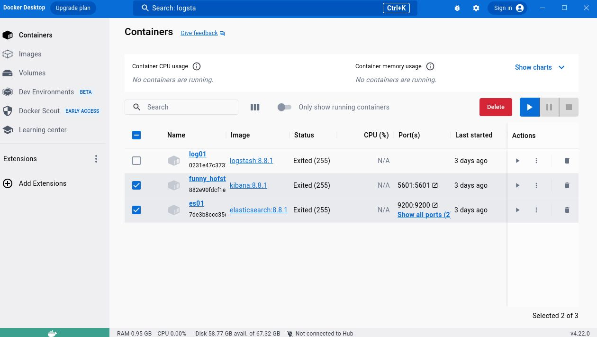

# MQTT to Kibana

As the title says. If you'd rather follow elasticsearch's guides:
- Elasticsearch
    - guide: https://www.elastic.co/guide/en/elasticsearch/reference/current/index.html
    - docker install: https://www.elastic.co/guide/en/elasticsearch/reference/current/docker.html
- Kibana:
    - guide: https://www.elastic.co/guide/en/kibana/current/index.html
    - docker install: https://www.elastic.co/guide/en/kibana/current/docker.html
- Logstash
    - guide: https://www.elastic.co/guide/en/logstash/current/introduction.html

## Basic Setup

1. Install Docker Desktop (https://docs.docker.com/desktop/install/ubuntu/)
2. Pull the [kibana](https://hub.docker.com/_/kibana) and [elasticsearch](https://hub.docker.com/_/elasticsearch) docker containers (just enter these keywords in the search bar at the top). It's important that your versions match, the version I downloaded was 8.8.1.


3. In the "images" tab, run the `elastic` container. Set a name and make sure to specify the host ports. Do the same thing with your `kibana` image.


4. Now you should be able to view your container instances of kibana and elasticsearch in the "Containers" tab. I named my elasticsearch instance "es01" and my kibana instance "funny_hofst"



5. Start your elastic container first from the "Containers" tab. If you don't see a port mapping listed in the ports tab, delete the container and go back to step 3. If you click on the name, you should see the tabs named  "logs", "inspect", "bind mounts", "terminal", "files", "stats" 

6. In the "logs" tab of your elastic container, there should be an enrollment token and user password printed to the log. If you're like me and didn't notice, you can open the "terminal" tab and run the following script:

```
cd /usr/share/elasticsearch/bin
./elasticsearch-reset-password -u elastic
./elasticsearch-create-enrollment-token -s kibana
```

7. Before you start your kibana container, download the `http_ca.crt` to your local machine from `/usr/share/elasticsearch/config/certs/http_ca.crt` within your elasticsearch container. You can find this file by browsing to the "files" tab of the elasticsearch container. If you don't have one, in the elasticsearch container terminal:

```
cd /usr/share/elasticsearch/bin
./elasticsearch-certutil ca
```

To verify the ca cert is good, run the following command. You may have to enter the password generated in step #6. 

```
curl --cacert http_ca.crt -u elastic https://localhost:9200
```

A successful output looks like:


8. Start your kibana container. The logs might print out a URL to browse to; otherwise browse to `127.0.0.1:5601` and enter the information that you just created, username `elastic`. You should now be able to log in to Kibana.


9. Now is time to get MQTT set up. I used the Mosquitto MQTT broker because it is natively installed on [DragonOS](https://cemaxecuter.com/). You can [download Mosquitto MQTT broker here](https://mosquitto.org/download/). Run the following commands after install

```
sudo systemctl start mosquitto.service
sudo systemctl status mosquitto
```

Here's a good status report:


10. Enter your `username:password` in the `.passwords` file that is at the same level as `subscriber.py`. For example, `.passwords` should look like:

```
elastic:mYSup3rs3cr3tp@$$w0rd!
```

11. If you're a pip purist and don't want to pollute your system with a [elasticsearch Python package](https://pypi.org/project/elasticsearch/) and [paho mqtt](https://pypi.org/project/paho-mqtt/) for MQTT  Python implementation, you can run a virtual environment

```
python3 -m venv .venv
source .venv/bin/activate
```

In either case, run the following to install necessary requirements

```
pip3 install -r requirements.txt
```

12. Start the publisher. Edit the location of your `http_ca.crt` in `subscriber.py`, then start the subscriber (yes I will make this more user friendly in the future). You should see no error messages and the output is populating roughly every two seconds in the terminal window

13. Back in Kibana on the home screen, scroll down until you see a cog wheel next to blue highlighted text "stack management". Click on that, then on the left side, click on "data view".


14. Create a new data view. If we're successful, you should see `mqtt_data` in the right of the screen. This is from line 11 of `subscriber.py` where the `es_index` variable is set. Use regex to match the source name, for example `mqtt*` or `mqtt_data`. Save the data view to kibana.


15. Back from the home page, go to the "Discover" tab


16. Select your new data view. 


17. Congrats! You should now be able to visualize the data that the Python client is sending around. It might take a minute to appear in Kibana if you are just starting, let the publisher & subscriber run for a couple of minutes before refreshing kibana.

## Word Cloud Visualization

The specific use case that I have been able to get this to work with has been using [sdr4space "DDC_whisper" example](https://github.com/irongiant33/SDR4Space-Examples/tree/DragonOS/RX/DDC_whisper), but I will keep the instructions general for the production of a word cloud in Kibana.

1. Follow the [basic setup](#basic-setup) guide to set up Elasticsearch and Kibana.
2. Modify `subscriber.py` file to subscribe to the topic that contains words you wish to visualize. 
    - If you are following the SDR4space example, `git checkout word-cloud` will update `subscriber.py` for you
    - A consideration here is that the `subscriber.py` in the `word-cloud` branch does pre-processing of the topic to break individual words out. If you do not send a list of individual words via keyword to Kibana, Kibana will process the entire keyword in the word cloud. Kibana's [ingest pipelines](https://www.elastic.co/guide/en/elasticsearch/reference/current/ingest.html) or logstash's [transformation options](https://www.elastic.co/guide/en/logstash/current/transformation.html) are alternate approaches to this.
        - a bad example:
        ```json
        {
            "words": "This is a sentence that will group into only one bucket in the kibana word cloud"
        }
        ```
        - a good example:
        ```json
        {
            "words": ["This", "is", "a", "sentence", "that", "will", "be", "broken", "into", "multiple", "buckets", "within", "kibana"]
        }
        ```
3. From Kibana home, navigate to the dashboard


4. Create a new dashboard, then "select type", "aggregation-based", "tag cloud"


5. Search for the data view that you created in the [basic setup](#basic-setup). In my case, it is called `mqtt`


6. Under the "buckets" tab in the right pane, select "add" then under "add bucket" select the "tags" option. Within the "aggregation" dropdown, select "terms".

7. Within the "field" dropdown, select the field where the words you wish to visualize are being ingested into kibana. In the above json example, the field is `words`. In the `word-cloud` branch example, the field is called `decoded-fm-words`.

8. The "order by" and "order" dropdowns determines the sorting metric and direction, respectively, for how words are arranged within the word cloud. The "count" metric and "descending" are fine options to start with.

9. The "size" field determines how large the word cloud will be. In other words, the top `size` words will be placed on to the word cloud. I modified the initial "5" to "200"

10. Click the blue "update" button in the bottom right corner and you should be able to visualize the word cloud. You can now click "save and return" in the top right to return to your dashboard.


11. Other configuration options:
    - The "metrics" dropdown on the right tab determines how the words are sized on the cloud. By default, it is "count", so the larger words occurred more frequently. In the case above `(empty)` was the most frequent word. 
    - In the top right, you can enable more frequent auto refresh by clicking on the "auto refresh" button, enabling the switch for auto refresh, and then setting the frequency with which the word cloud will refresh.
    - Once you're back at the main dashboard view, you can edit the window of time in which the word cloud will have populated. By default it is the past 15 minutes. 

## Modifying the Subscriber and Data Processor

Most of the content you will need to edit within `subscriber.py` will be at the top of the file:

```python
mqtt_broker_address = "0.0.0.0"
whisper_topic = "SDR/dev3/whisper"
message_processing = {
    "whisper_msg": [
        data_processor.remove_strings_within_square_brackets,
        data_processor.split_words_on_whitespace
        ]
}
```

The `mqtt_broker_address` should be changed to the IP where the MQTT broker is being hosted

The `whisper_topic` should be changed to the name of the topic that you expect to receive messages from SDR4Space, or whatever topic is publishing MQTT messages

The `message_processing` dictionary should be changed based on how you want to process fields within the MQTT messages you are receiving on the topic. This makes the assumption that MQTT is passing messages in JSON format. It discards all messages that are not in JSON format. For example, if you receive a MQTT message that looks like the following:

```json
{
    "station": "dev3",
    "date": "20230827-215830",
    "whisper_msg": "[00:00:00.000 --> 00:00:03.060]   70. Tuesday, thunderstorm.                                                                                                                                 
[00:00:03.060 --> 00:00:13.060]   [BLANK_AUDIO]",
    "frequency": "162.550"
}
```

The key of the `message_processing` dictionary defines the field you wish to edit. In the above case, it is "whisper_msg". The value is a list of processors you want to apply **in order**. You can add to `data_processing.py` to expand the processors you add. In the above case, we are removing all data between brackets and then splitting each word into a list of words. The output json that is sent to elastic looks as follows:

```json
{
    "station": "dev3",
    "date": "20230827-215830",
    "whisper_msg": ["70.",
                    "Tuesday",
                    "thunderstorm"
    ],
    "frequency": "162.550"
}
```
## Todo

- [ ] use [logstash](https://www.elastic.co/guide/en/logstash/current/first-event.html) (you can pull the [logstash docker](https://hub.docker.com/_/logstash) just as you did with kibana and elasticsearch) to parse data from `publisher.py` and ingest it into Kibana via Elastic. I spent a lot of time trying to figure out [filebeat](https://www.elastic.co/guide/en/beats/filebeat/current/filebeat-overview.html) but it didn't work.
- [ ] parameterize the publisher and subscriber so that there isn't any need to edit the source
- [ ] figure out mapping features:
   - https://www.elastic.co/guide/en/kibana/current/maps-getting-started.html
   - https://www.elastic.co/guide/en/elasticsearch/reference/current/geo-point.html
   - Instead of "discover" go to "dashboard", create a new dashboard, then select the "maps" button that is 3 icons to the right of "create visualization"
